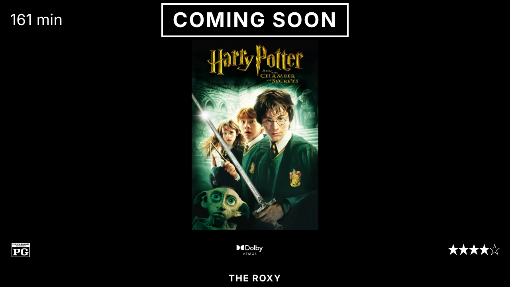
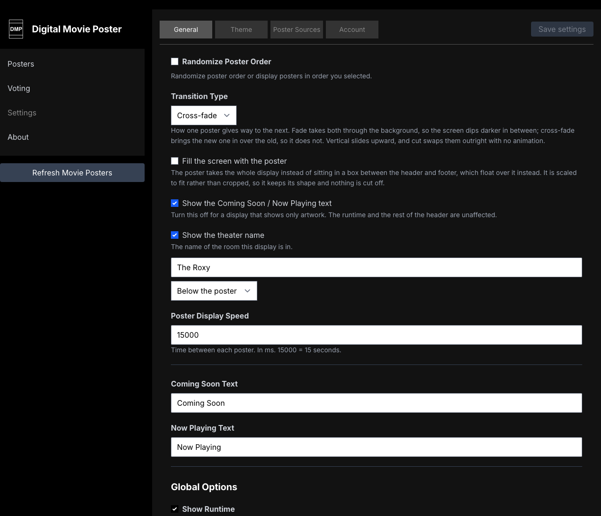

# The display

What goes on screen, and how it changes. Everything here lives under
**Settings → General** unless noted.



Where these options live:



## How one poster gives way to the next

**Transition Type** offers four:

| | |
| :--- | :--- |
| **Fade** | Both posters fade at once, so the screen dips briefly darker between them. |
| **Cross-fade** | The new poster arrives over the old one, which holds until it is covered — no dip. |
| **Vertical** | The new poster slides up as the old one leaves. |
| **Cut** | No animation. One poster replaces the next outright. |

**Poster Display Speed** is how often the poster changes, in milliseconds —
`15000` is fifteen seconds. The transition runs at the start of that time, so a
fifteen second setting with a cross-fade is about thirteen seconds of stillness
and a second and a half of movement.

The details around the poster — the runtime in the header, and the content
rating, processing logos and star rating in the footer — belong to the poster on
screen, so they change with it under the same transition rather than snapping to
the next film while the artwork is still fading.

## Filling the screen

**Fill the screen with the poster** takes the artwork out of its box between the
header and footer and gives it the whole display. It is scaled to fit rather
than cropped, so a 2:3 poster on a 16:9 screen comes out full height and nothing
is cut off.

The header, footer and theatre name float over the artwork instead of sitting on
it, with a gradient behind them so their text stays readable. **Shading behind
the header and footer** controls how heavy that gradient is — *None*, *Subtle*,
*Standard* or *Strong*. A dark poster needs none of it; a bright one needs quite
a lot before white text over it can be read. Standard is a reasonable starting
point.

Each end is shaded only when something is actually shown there. Turn off the
header wording, the runtime, the ratings and the logos and a display shows the
artwork alone, with no band across either end. It follows whichever end things
are on, so moving the header or the theatre name moves the shading with it.

A trailer keeps its own box even in fill mode: a video stretched to an arbitrary
screen shape looks wrong in a way a poster does not.

## The text on screen

**Show the Coming Soon / Now Playing text** turns the header wording off for a
display that should show only artwork. The runtime and the rest of the header
are unaffected.

**Header plate** dresses the wording with the same five options as the theatre
name below — plain, rules, marquee bulbs, plaque or neon. *Plaque* is the box
the header used to have; it keeps its own border colour from the **Theme** tab,
and a display that already had that box was carried over to it, so nothing
changed appearance on updating.

The header can sit **above or below the poster**, and either plate can **span
the width of the screen** instead of hugging its words — the rules stretch, the
bulbs repeat across, and a plaque becomes a band.

**Show the theater name** puts the name of the room the display is in above or
below the poster, in whichever font the header is using.

**Name plate** decides how it is dressed, with the same five as the header. All
are drawn in the header's text colour, so the name matches the rest of the
screen:

| | |
| :--- | :--- |
| **Plain** | The name on its own. The default, and what a display already showing its name keeps. |
| **Rules either side** | Hairlines flanking the name — reads as a caption rather than a label. |
| **Marquee bulbs** | A row of bulbs above and below. The one that reads as a cinema from across a room. |
| **Plaque** | A bordered plate that hugs the name, like an engraved sign. |
| **Neon glow** | A soft halo in the same colour. Best in a dark room, and best with a colour that is not white. |


The wording — what it says instead of *Coming Soon* and *Now Playing* — is on
the same **General** tab. The fonts, sizes, colours and borders are under
**Settings → Theme**.

## Processing logos

**Which logos to show** decides where the Dolby Atmos, Dolby Vision, DTS:X,
Auro-3D, IMAX and 5.1 badges come from:

| | |
| :--- | :--- |
| **Only the ones each title supports** | The formats set on the poster when you edit it. |
| **Each title's own, or the ones above if it has none** | Falls back to the global set for titles you have not filled in. |
| **The ones above, on every title** | Ignores what each title supports and shows the same badges everywhere. |

The last one is why a film with no Atmos soundtrack can end up displaying the
Atmos logo. Choose the first if the badges should mean something.

## Limiting what is shown

**Movie Rating Display Limit** and **TV Rating Display Limit** hide anything
rated above the limit you pick. *None* shows everything.

Two things worth knowing:

- Media with **no rating at all is not shown** when a limit is set. A poster
  that has never had its rating filled in will quietly disappear from the
  rotation.
- If a limit excludes every poster you have, the display has nothing to show.

## Posters in the rotation

Only posters with **Show in rotation** on are cycled. Order comes from the
drag-and-drop arrangement on the Posters screen, unless **Randomize Poster
Order** is on.

A running display re-reads the library every four hours, and saving a poster
tells it to refresh straight away. **Refresh Movie Posters** in the sidebar
makes it pull the library again on demand — useful after editing posters
directly in the database.

A refresh keeps whatever is on screen up rather than clearing it, so it is not
visible unless the poster showing has itself left the rotation.

## Rotating the picture

If the screen is mounted portrait, load the display with `?rotate=true`:

```
http://raspberrypi.local/?rotate=true
```
