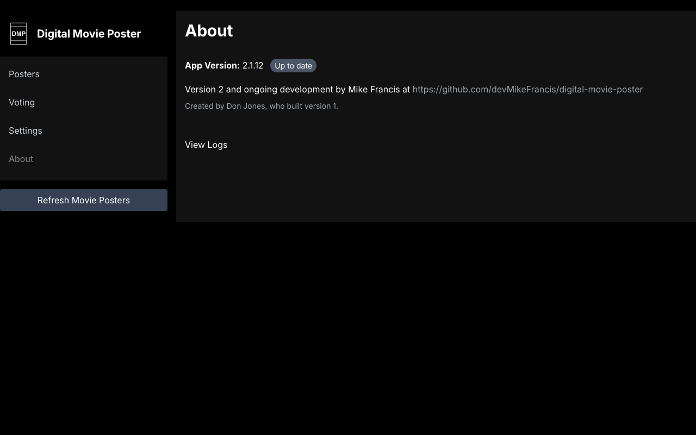

# Updating

Taking a new release, and the two migrations that need doing by hand.



Visit the `About` page to check for updates, or run `./update.sh` on the device.

Unlike previous versions, `update.sh` refuses to run when the working tree has
local changes rather than discarding them with `git reset --hard`. Commit or
stash your edits first.

### Upgrading from a pre-Laravel-13 install

Installs made before this release run PHP 8.1, and this release needs 8.3 or
newer, so `update.sh` cannot upgrade them in place — it checks the PHP version
first and stops before changing anything.

Re-run the installer instead. It is safe to run again, and it upgrades PHP,
installs what is missing, and leaves your database and posters alone:

```bash
wget -O install.sh https://raw.githubusercontent.com/devMikeFrancis/digital-movie-poster/main/install.sh
chmod u+x install.sh
sudo ./install.sh $USER
```

Afterwards the settings screen will ask you to create an administrator account,
and your media-server credentials get encrypted in place on the first
`php artisan migrate`.

### Migrating an existing MariaDB install to SQLite

New installs use SQLite. Existing MariaDB installs keep working — uncomment the
`DB_CONNECTION=mysql` block in your `.env`. To move across:

Leave `DB_HOST`, `DB_DATABASE`, `DB_USERNAME` and `DB_PASSWORD` in `.env`
while you do this — the copy step still needs them to read the old database.
Back up `database/` and take a `mysqldump` first.

```bash
php artisan down
# 1. Switch the default connection to SQLite, keeping the mysql credentials
sed -i 's/^DB_CONNECTION=mysql/DB_CONNECTION=sqlite/' .env
touch database/database.sqlite
php artisan migrate --force
# 2. Copy the two tables that hold your data
php artisan tinker --execute='
    $old = DB::connection("mysql");
    foreach (["settings", "posters"] as $table) {
        DB::table($table)->delete();
        foreach ($old->table($table)->get() as $row) {
            DB::table($table)->insert((array) $row);
        }
    }
'
php artisan up
```

Poster images live on disk under `storage/app/public/posters` and are not
affected.
