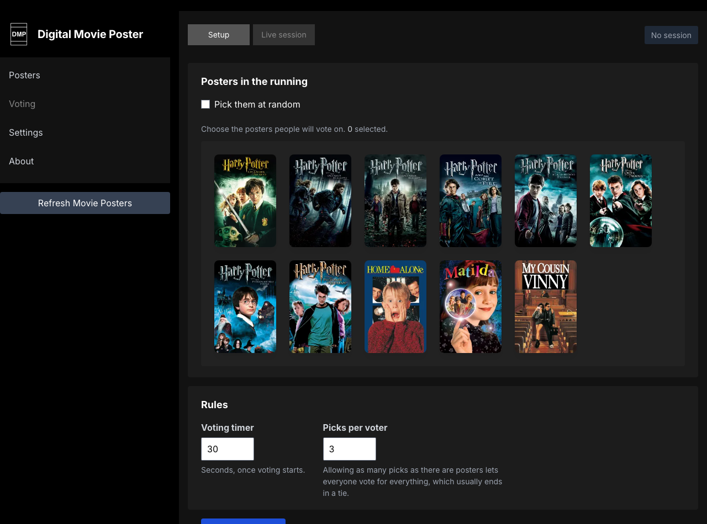

# Movie voting

Putting a few posters to a vote and letting people in the room choose from
their phones.

Put a few posters up for a vote and let people in the room choose from their
phones. There is no wiki — this is the documentation.

**Requirements.** Voting rides on the Node socket server in `socketserver/`.
`install.sh` sets it up; locally, run `node socketserver/server.js` alongside
`php artisan serve`. The socket server also talks to Redis for now-playing, but
it keeps running and retrying without it, so voting works on a machine that has
no Redis.

1. Sign in and go to **Voting**. The **Setup** tab is where you build a
   session — no name needed, it is the admin screen.
2. Choose posters by hand, or tick **Pick them at random** and set how many go
   into the running.
3. Set **Picks per voter** — how many posters each person may choose. Note that
   allowing as many picks as there are posters lets everyone vote for
   everything, which usually ends in a tie.
4. Press **Open for joining**. The display stops its slideshow and becomes a
   voting screen: **Vote Now**, the QR code large in the middle, and how long is
   left along the bottom once the round starts. A small code in the corner of a
   changing slideshow asked people to notice it between posters and then scan
   something the size of a stamp from across the room.
5. People scan it, land on `/vote`, and enter a name. That page is public on
   purpose: voters are guests and have no account. It cannot change any
   setting — it can only cast votes into a session you opened.
6. Press **Start voting** on the **Live session** tab when everyone is in. That
   tab is the console for the running vote: who has joined, who has voted, and
   the count against each poster as it lands. Results appear when the timer
   expires. **Join the vote** opens the voter page in a new tab so whoever is
   running the session can take part too — keep the console tab open, since it
   holds the controls.
   Latecomers are welcome: anyone who scans and joins after voting has started
   picks up the clock where it is and votes with whatever time is left.
7. **Close voting** ends the round early and shows the result there and then,
   rather than waiting out the clock.
8. The winner appears on that same display screen when the round ends. Ten
   seconds later the session closes itself and the display goes back to the
   slideshow. **Close session** ends it sooner. A session that is opened for
   joining and never started closes on its own after ten minutes, so the
   display is not left showing a vote nobody is running. The winner is not lost
   at that point: it stays on the Setup tab, and on the voting page for anyone
   still watching, labelled as the last session's winner until the next round
   starts.

The admin screen, where a session is built and run:

What a guest sees after scanning:

The number of picks is enforced on the server as well as in the page, so a
modified client cannot vote more times than the session allows.

Votes survive the connection. Phones lock, tabs get closed, and a backgrounded
tab has its websocket closed out from under it - a vote already cast stays in
the count for the rest of the round. Each browser keeps a voter id in local
storage, so coming back rejoins the same ballot: the page shows the picks
already made, changing them replaces that vote, and reconnecting does not cast a
second one.
